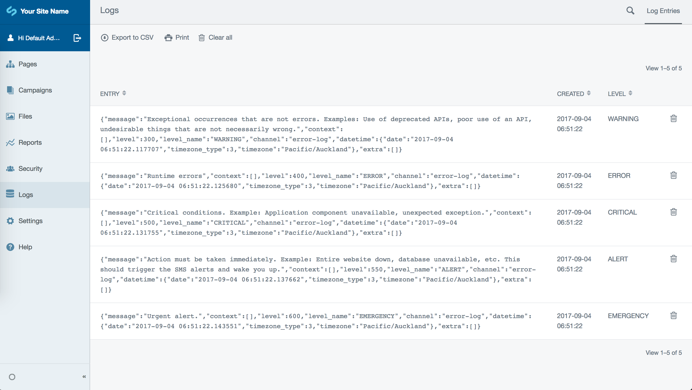

# silverleague/silverstripe-logviewer

[](https://travis-ci.org/silverleague/silverstripe-logviewer) [](https://scrutinizer-ci.com/g/silverleague/silverstripe-logviewer/?branch=master) [](https://codecov.io/gh/silverleague/silverstripe-logviewer) [](https://packagist.org/packages/silverleague/logviewer) [](//packagist.org/packages/silverleague/logviewer)

Show your SilverStripe log entries in the CMS.

## Requirements

* PHP 5.6+
* SilverStripe ^4.0
* Composer

## Installation

Install with composer:

```shell
composer require silverleague/logviewer
```

This is a plug and play module. Simply install, then run a `dev/build` and flush:

```shell
sake dev/build flush=1
```

You will now see a "Logs" tab in the CMS:



## Configuration

There are a few configuration options for this module. These can be modified in your YAML configuration, for example - `mysite/_config/logviewer.yml`:

```yaml
---
Name: mysitelogviewer
---
# Configuration for the cleanup task
SilverLeague\LogViewer\Model\LogEntry:
  # Whether the cleanup task should be run by a cron task (you need to figure the cron yourself)
  # Type: bool
  cron_enabled: true
  # How often the cron should run (default: 4am daily)
  # Type: string (a cron expression)
  cron_schedule: 0 4 * * *
  # The maximum age in days for a LogEntry before it will be removed by the cleanup task
  # Type: int
  max_log_age: 30
  # Which Monolog\Logger levels (numeric) to start handling from (see class for examples)
  minimum_log_level: 300 # WARNING
```

While this is a copy of the default configuration, if the default configuration hadn't already existed or was different then this configuration would tell LogViewer that you _do_ want it to clean up log entries older than 30 days on a cron schedule at 4am each day. You also only want to keep logs that are "WARNING" level or higher (see `Monolog\Logger` for all available levels).

### Testing

There is an [example `BuildTask` in this repository](docs/examples/CreateLogsTask.php) which you can use to generate one of every PSR-3 log level for the sake of testing.

The screenshot above is a result of having run it, using the configuration in the example above.

## Cleaning up

As mentioned previously, if you have an actively running `silverstripe/crontask` module already, the `RemoveOldLogEntriesTask` will run by default at 4am every morning and will remove log entries that are older than 30 days.

You can run the task manually from the command line using `sake` or [`ssconsole`](https://github.com/silverleague/silverstripe-console):

```shell
# With sake:
sake dev/tasks/RemoveOldLogEntriesTask

# With ssconsole:
ssconsole dev:tasks:remove-old-log-entries
```

You can also remove **all log entries entirely** from the Logs interface in the admin area, by clicking "Clear all". This will clear all logs, not just those older than 30 days.

## Support

If you encounter a problem with our module then please let us know by raising an issue on our [issue tracker](https://github.com/silverleague/silverstripe-logviewer/issues).

Ensure you tell us which version of this module you are using, as well as which versions of PHP and SilverStripe framework you are using. If you aren't sure, you can find out by running the following commands from your command line: `php -v`, `composer show silverleague/logviewer` and `composer show silverstripe/framework`.

| Role          | Name                                              |
| ------------- | ------------------------------------------------- |
| Maintainer    | [robbieaverill](https://github.com/robbieaverill) |
| Co-maintainer | [Firesphere](https://github.com/Firesphere)       |
| Advocate      | TBC                                               |

## Contributing

Please see [the contributing guide](CONTRIBUTING.md) for more information.
